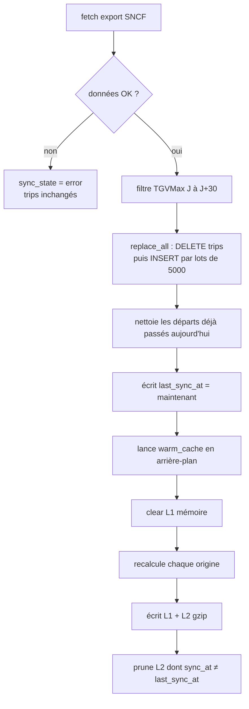

# Sync SNCF → Mongo → warm cache

Toutes les 15 min, ou via `POST /api/sync/trigger`. Une seule sync à la fois.

On télécharge l’export SNCF, on filtre (TGV Max, J à J+30), on **remplace** la collection `trips`, puis on écrit `last_sync_at`. Le warm démarre ensuite **en fond** : il vide le L1, recalcule chaque origine, écrit L1 + L2 gzip, et supprime les anciens documents.

Le `POST /trigger` répond dès que `last_sync_at` est écrit, sans attendre le warm (~50 s). Si une nouvelle sync arrive pendant un warm, on termine le warm en cours puis on en relance un.

Si l’API SNCF est down : erreur enregistrée, trips inchangés.

