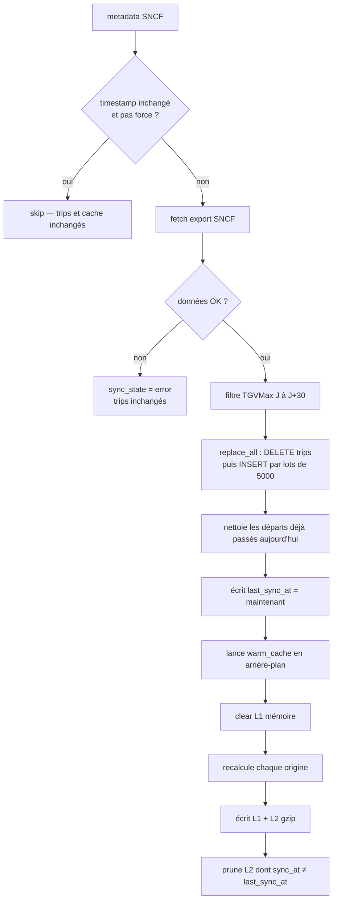

# Sync SNCF → Mongo → warm cache

Toutes les 15 min, on lit d’abord `sncf_data_updated_at`. Si inchangé : **rien** (pas d’export, pas de warm). `POST /api/sync/trigger` force toujours un rebuild.

Rebuild : export SNCF → filtre J à J+30 → `replace_all` → `last_sync_at` → warm en fond (L1 vidé, L2 gzip).

Les départs déjà passés sont retirés **à la lecture** du cache, même sans warm.

Si l’API SNCF est down : erreur enregistrée, trips inchangés. Si le metadata est illisible : on fait l’export (pas de skip à l’aveugle).

