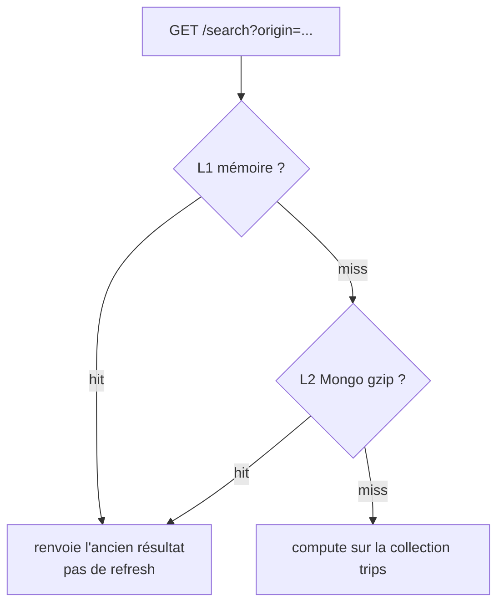

# Recherche pendant le fetch / `replace_all`

`last_sync_at` n’a pas encore changé. Le cache est donc encore considéré à jour : on sert l’**ancienne** réponse, sans refresh.

Le trou : une origine **sans cache** lit `trips` pendant le `DELETE` + `INSERT`. La collection peut être vide ou incomplète, et ce mauvais résultat peut être écrit en cache.

