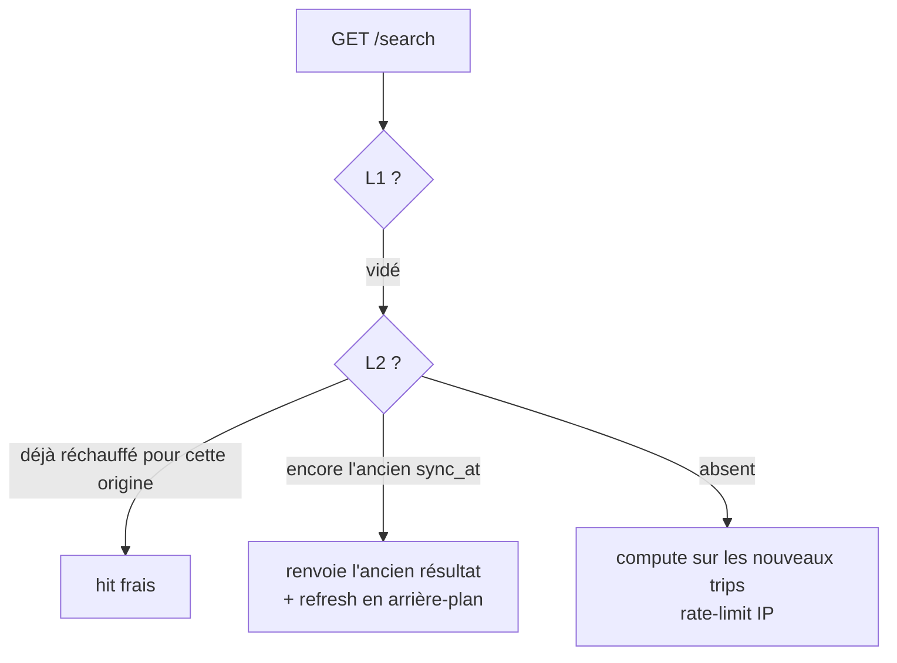

# Recherche après `last_sync_at`, pendant le warm

Les nouveaux trains sont en base, `last_sync_at` est à jour, mais le cache se reconstruit encore. Le L1 a été vidé. Le L2 mélange documents neufs et anciens.

- Origine déjà réchauffée → hit frais
- Ancien L2 encore là → on le sert, et on recalcule en fond
- Pas de L2 → cold compute sur les nouveaux trips

