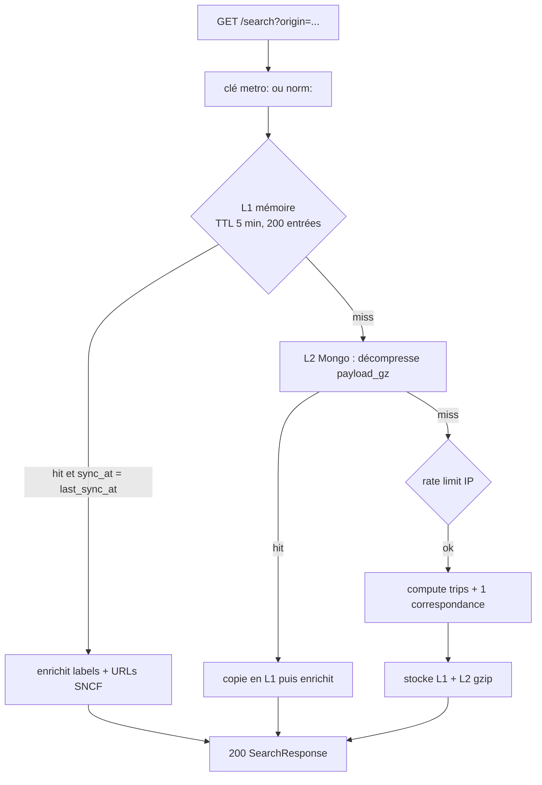

# Recherche après sync (warm terminé)

Cas normal entre deux syncs.

L1 (mémoire, 5 min) → sinon L2 gzip → sinon calcul depuis `trips`. On ajoute labels et URLs SNCF à la lecture. Le rate limit (10/min/IP) ne s’applique qu’au calcul à froid.

